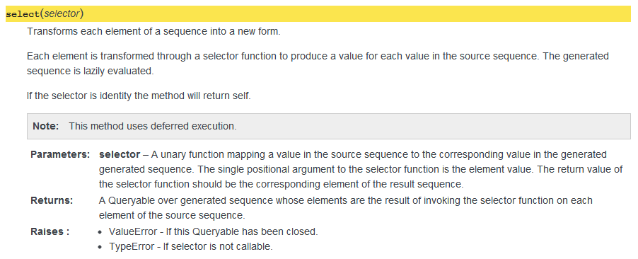

Overview
========

Hieroglyph was motivated by a desire to support docstrings in a style
compatible with that in the `Google Python Style Guide`_. Currently function
and method docstrings in the Google style are supported, although it is planned
to add support for class docstrings in a future release.

The syntax supported by Hieroglyph goes some way beyond that described
informally in the Google Style Guide, although I have attempted to remain
compatible with the Google guide.

The main benefit of this simple and highly readable docstring format over the
native reStructuredText Sphinx format is that it retains its readability when
used with the ``help()`` function in the Python REPL, or when presented by
IDEs.

Functions and Methods
=====================

Function or method docstrings may contain any text, however, text introduced by
block headings will be treated specially during processing of the docstring and
converted into reStructuredText equivalents before being passed along to Sphinx
for rendering.

The special blocks currently recognised by Hieroglyph are ``Args:``,
``Returns:``, ``Return:``, ``Raises:``, ``Note:`` and ``Warning:``.  The order
of the blocks is not significant, although most function docstrings will
consist of a preamble following by  ``Args:``, ``Returns:`` and ``Raises:`` in
that order.

A typical docstring
-------------------

Let's start by showing a complete and typical docstring.  This one is taken
from the open source asq_ project which uses Hieroglyph for it's docstrings::

  def select(self, selector):
      '''Transforms each element of a sequence into a new form.

      Each element of the source is transformed through a selector function
      to produce a corresponding element in teh result sequence.

      If the selector is identity the method will return self.

      Note: This method uses deferred execution.

      Args:
          selector: A unary function mapping a value in the source sequence
              to the corresponding value in the generated generated sequence.
              The single positional argument to the selector function is the
              element value.  The return value of the selector function
              should be the corresponding element of the result sequence.

      Returns:
          A Queryable over generated sequence whose elements are the result
          of invoking the selector function on each element of the source
          sequence.

      Raises:
          ValueError: If this Queryable has been closed.
          TypeError: If selector is not callable.
      '''

This docstring consists of a arbitrarily structured preamble.  The first
Hieroglyph feature is the ``Note:`` block.  Here the note content has been
included on one line, although the note content may extend over several lines
if approriate indentation is used.  Indentation in Hieroglyph docstrings can be
of any size, but must be consistent, since the indentation is used to extract
structure - much like Python code itself.  The body of a paragraph such as a
``Note:`` can either start on the same line as the heading after the colo—
which is useful for short notes—or can start on the next line if indented.

The second Hieroglyph heading is ``Args:`` which introduces an argument list.
Each named argument have its own heading followed by a colon followed by one
or more lines of description.  Again, the description can start on the same
line or be indented on the following line. There is no need to use blank lines
between arguments - indentation alone is used to extract the structure.

The third Hieroglyph heading is ``Returns:`` which may also be spelt
``Return:``. In this example, the author has chosen to start the paragraph on
the indented next line.

The final Hieroglyph heading is ``Raises:`` This is followed by a list of
paragraphs each introduced by a heading which is the exception type.

This docstring, when processed by Hieroglyph will result in the following
reStructuredText markup::

::

  Transforms each element of a sequence into a new form.

  Each element of the source is transformed through a selector function
  to produce a corresponding element in teh result sequence.

  If the selector is identity the method will return self.

  .. note::

     This method uses deferred execution.

  :param selector: A unary function mapping a value in the source sequence
      to the corresponding value in the generated generated sequence.
      The single positional argument to the selector function is the
      element value.  The return value of the selector function
      should be the corresponding element of the result sequence.

  :returns: A Queryable over generated sequence whose elements are the result
      of invoking the selector function on each element of the source
      sequence.

  :raises:
      * ValueError - If this Queryable has been closed.

      * TypeError - If selector is not callable.

This in turn will be rendered by Sphinx into HTML like this:

Now we look at each heading in detail and the syntax it supports:

Args
----

The ``Args:`` heading is for specification of function arguments. Each
argument must be described by its own indented paragraph introduced by a colon
terminated heading which is the name of the argument. The descriptive text for
the argument can begin either on the same line as the argument name or
indented on subsequent lines.  The following are examples are legitimate
``Args:`` blocks::

  Args:
      spline: A cubic SplineCurve containing at least three points.
      curvature: A float value between 0.0 and 1.0.
      color: An RGB tuple.

or::

  Args:
      spline:
          A cubic SplineCurve containing at least three points.

      curvature:
          A float value between 0.0 and 1.0.

      color:
          An RGB tuple.

or::

  Args:
      spline: A cubic SplineCurve containing at least three points. Longer
          descriptions which wrap beyond one line can either be started on
          the same line as the parameter name, like this one.
      curvature:
          A float value between 0.0 and 1.0. Or could be started on the next
          line provided a suitable indent is given.

      color: An RGB tuple. Blank lines between arguments are optional.

For so-called *varargs* syntax in Python which allow receiving arbitrary
positional and keyword arguments as a tuple or dictionary respectively, simply
prefix the argument name with ``\*`` or ``\*\*`` as you would in Python code.
For example::

  Args:
      *args: A tuple of positional arguments.

      **kwargs: A dictionary of named arguments.

Optionally, you may provide a type for the argument in parentheses between
the argument name and the colon.  The type can be any text and does not need
to correspond to an actual Python type::

  Args:
      spline (SplineCurve): A cubic SplineCurve containing at least three
          points.

      curvature (float): A value between 0.0 and 1.0.

      color (tuple of integers): An RGB tuple with values in the range 0-255.

It's possible to use almost any reStructuredText or Sphinx formatting in
combination with Hieroglyph in the body text.

Return and Returns
------------------

The ``Returns:`` heading which can also be spelled ``Return:`` is for the
specification of return values.  There is no specific syntax for describing the
return type, which you should typically mention in the body text. The
description can begin on the same line at the heading or indented on
subsequent lines. Both of the following are valid::

  Returns: A short description on the same line as the heading.

or::

  Returns:
      A longer description which starts on the next line indented one level.
      It's a little awkward to make up documentation like this when you have
      nothing to say.

or combined::

  Returns: There's nothing to stop you starting a multi-line description like
      this one the same line as the heading, so long as you indent subsequent
      lines in the paragraph, like this.

If the function you are documenting is a generator, prefer to use ``Yields:``
rather than ``Return:`` - see below.

Yield and Yields
----------------

The ``Yields:`` heading, which can also be spelled ``Yield:`` is for the
specification of the sequence of values returned by a *generator*.  When
documenting a generator, prefer to use ``Yields:`` over ``Returns:``.  Note
that Hieroglyph will *not* verify that the function being documented is
actually a generator. he
description can begin on the same line at the heading or indented on
subsequent lines. Both of the following are valid::

  Yields: A short description on the same line as the heading.

or::

  Yields:
      A longer description which starts on the next line indented one level.
      It's a little awkward to make up documentation like this when you have
      nothing to say.

or combined::

  Yields: There's nothing to stop you starting a multi-line description like
      this one the same line as the heading, so long as you indent subsequent
      lines in the paragraph, like this.

Raises
------

The ``Raises:`` heading is used to specify exception types which can be
raised by the function. The heading is followed, on subsequent indented
paragraphs by further sections each of which details a single exception type.
The paragraph for each exception type is introduced by a heading which is the
exception type itself.  For example, given a function which raises two distinct
exception types, the following formats are acceptable::

  Raises:
      TypeError: A short description for a TypeError.
      ValueError: A short description for a ValueError.

or::

  Raises:
      TypeError: A multi-line description for a TypeError which begins on the
          same line as the heading which introduced the type error. Subsequent
          lines must be indented.

.. _Google Python Style Guide: http://google-styleguide.googlecode.com/svn/trunk/pyguide.html#Comments

.. asq: http://code.google.com/p/asq/
